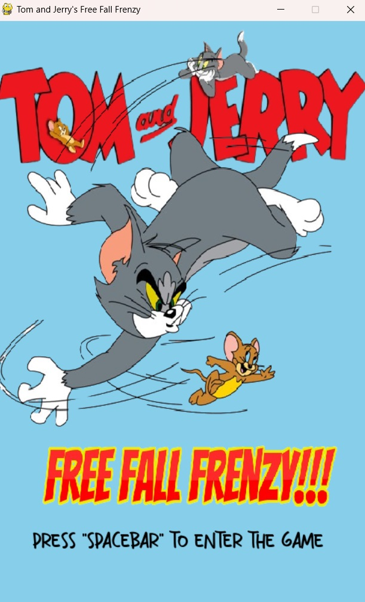

<h1 align="center">Tom and Jerry Free Fall Frenzy</h1>
<h3 align="center">Welcome to Tom and Jerry Free Fall Frenzy'!. 
</h3>
<h3 align="center">In this game, Jerry falls from the sky, trying to avoid Tom while collecting cheese for extra lives. 
But watch out! Tom gets faster as jerry go down.</h3>
<h4 align="center">Can you help Jerry escape? Let's dive into this exciting adventure filled with cheese, challenges, and endless excitement</h3>


<h2 align="left">Libraries and Packages:</h2>


<p align="left">
<a href="https://www.python.org" target="_blank" rel="noreferrer">  </a>
<a href="" target="_blank" rel="noreferrer">  </a>
</p>


<h2 align="left">Packages and Work Flow</h2>


<h3 align="left">Pygame Library</h3>

- **Initialization** : “pygame.init()” is called to initialize all imported pygame modules. This is necessary before using any other pygame functions

- **Screen Setup** : “pygame.display.set_mode([WIDTH, HEIGHT])” creates a window with specified width and height for the game.

- **Image Loading** : Various images used in the game (such as clouds, Tom, and Jerry) are loaded using “pygame.image.load()”. These images are scaled and transformed as needed.

- **Rectangles** : “ pygame.rect.Rect()” is used to create rectangles for collision detection and drawing shapes.

- **Sound** : Sound effects and music are loaded and played using “pygame.mixer.Sound()” and “pygame.mixer.music.load()”

- **Event Handling** : The pygame.event.get() function retrieves a list of all the events t that have occurred since the last call. This is used to handle user input, such as keyboard keyboard events for controlling Jerry's movement and for quitting the game.

<h3 align="left">Random Module</h3>

- **Random Number Generation** : “random.randint(a, b)” is used to generate a n    random integer between  a and b, inclusive. This is used for various purposes such as det determining initial positions of objects, generating random cloud types, and setting enemy spawn positions.

- **Random Choice** : random.choice(seq) is used to choose a random element from a s sequence (seq). This is utilized for selecting cloud images and determining whether to generate one or two clouds 

- **Randomized Enemy Movement** : The speed of enemies is determined based on the current score using current_score//15, providing increasing difficulty as the game progresses. 

- **Randomized Cloud Placement** : The placement of clouds and cheeses is random within certain constraints. Clouds are positioned at random heights within specified ranges and cheeses are placed randomly within cloud boundaries.


<h2 align="left">Installation</h2>
<h3>To get started with this project, clone the repository and install the necessary libraries in your system</h3>

```bash
# Clone the repository
git clone https://github.com/Rupesh2728/Tom-and-Jerry-Free-Fall-Frenzy---Multimedia-Systems.git

# Navigate to the project directory
cd Tom-and-Jerry-Free-Fall-Frenzy---Multimedia-Systems-main

# Run the code
python Main.py
```


<h2 align="left">Game Images</h2>
<a href="" target="_blank" rel="noreferrer"> 
 
</a>

<a href="" target="_blank" rel="noreferrer"> 
 
</a>

<a href="" target="_blank" rel="noreferrer"> 
 
</a>


<h2 align="left">Contact Me</h2>

- 📫 You can to reach me by mailing to **rupesh.p21@iiits.in** or **rupeshprofessional2728@gmail.com**

- 👨‍💻 Project is available at [https://github.com/Rupesh2728/Tom-and-Jerry-Free-Fall-Frenzy---Multimedia-Systems.git]
  


